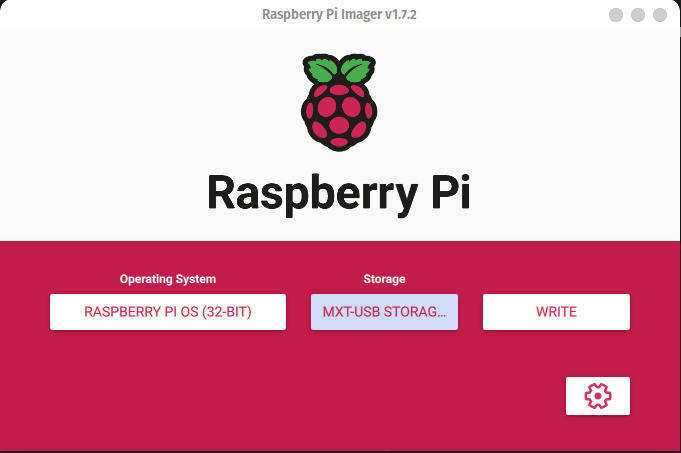
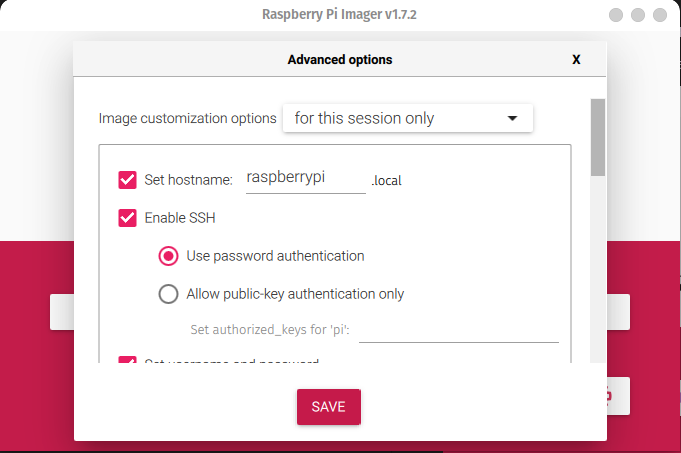
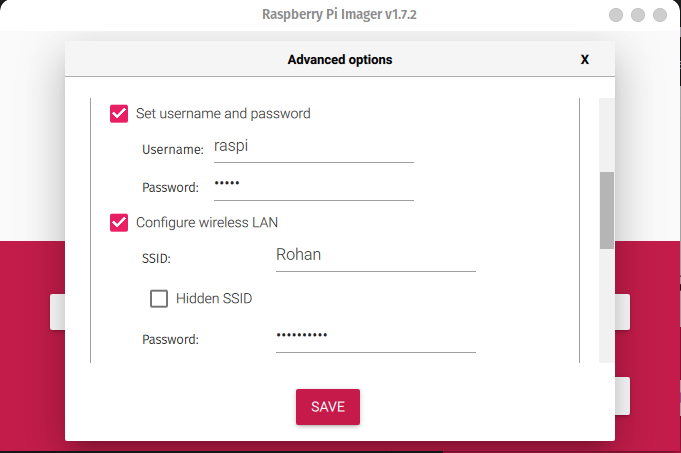
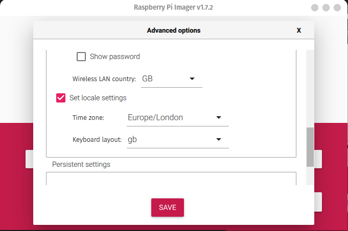
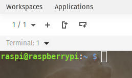
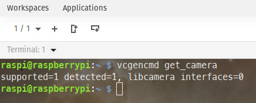
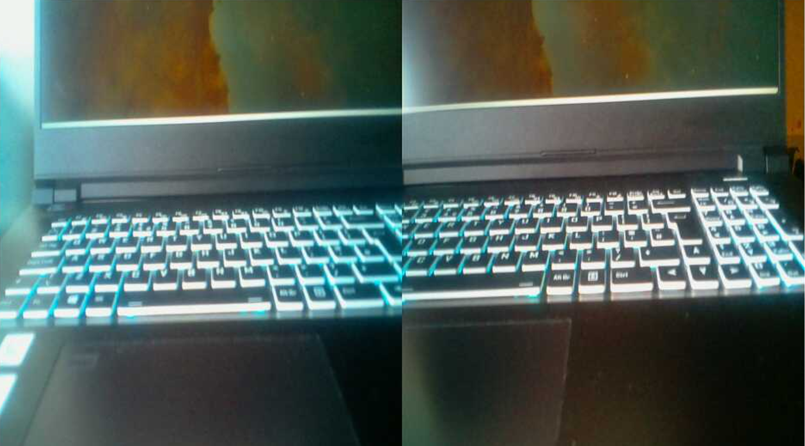

<p align="center"><b><ins> Raspberry Pi 4 Stereo Camera Headless Setup </b></ins></p>

<br>

A set of steps used to setup the Raspberry Pi 4 with the Arducam 5MP Camarray Hat (UC-512) in a headless manner using Pop!_OS-22.04.

<br>

---

<br>

<b><ins> Part A. Setup the Raspberry Pi </ins></b>

<br>

<ins> Step 1 </ins> : Get Raspberry Pi Imager from Pop Shop or through their [website](https://www.raspberrypi.com/news/raspberry-pi-imager-imaging-utility/).

<ins> Step 2 </ins> : Choose the operating system and the storage.



<br>

<ins> Step 3 </ins>: Click on the gear icon (Advanced Options; can also be accessed by crtl+shift+x) and modify the following:







<br>

<ins> Step 4 </ins> : Write

<ins> Step 5 </ins> : Insert the memory card into the raspberry pi.

<br>

---

<br>

<ins><b> Part B. SSH into Raspberry Pi </b></ins>

<br>

<ins> Step 1 </ins>: Connect the computer and the raspberry pi to the same network.

<ins> Step 2 </ins>: Remove previously generated ssh keys: ```ssh-keygen -f "/home/rohan/.ssh/known_hosts" -R "raspberrypi.local"```

<ins> Step 3 </ins>: SSh into the Raspberry Pi: ```ssh raspi@raspberrypi.local```

<ins> Step 4 </ins>: Type "yes", and enter the password

<ins> Step 5 </ins>: You should see this:



---

<br>

<b><ins> Part C. Configure the Raspberry Pi </ins></b>

This part takes quite some time.

<br>

<ins> Step 1 </ins>: ```sudo apt update --fix-missing```

<ins> Step 2 </ins>: ```sudo apt upgrade -y```

<ins> Step 3 </ins>: ```sudo reboot```

<ins> Step 4 </ins>: ```sudo rpi-update```

<ins> Step 5 </ins>: ```sudo reboot```

<ins> Step 6 </ins>: ```sudo raspi-config```

<ins> Step 7 </ins>: Interface Options -> Toggle Legacy Camera, SSH, VNC, SPI, I2C

<br>

---

<br>

<ins><b> Part D: Install/ Modify packages </b></ins>

<ins> Step 1 </ins>: ```sudo apt-get update && apt list --upgradable```

<ins> Step 2 </ins>: ```sudo apt-get install build-essential cmake pkg-config libjpeg-dev libtiff5-dev libjasper-dev libpng-dev libavcodec-dev libavformat-dev libswscale-dev libv4l-dev libxvidcore-dev libx264-dev libfontconfig1-dev libcairo2-dev libgdk-pixbuf2.0-dev libpango1.0-dev libgtk2.0-dev libgtk-3-dev libatlas-base-dev gfortran libhdf5-dev libhdf5-serial-dev libhdf5-103 python3-pyqt5 python3-dev -y```

<ins> Step 3 </ins>: ```pip3 install opencv-python```

<ins> Step 4 </ins>: ```sudo apt install python3-opencv```

<ins> Step 5 </ins>: ```sudo nano /boot/config.txt```

<ins> Step 6 </ins>: Add line ```dtoverlay=arducam``` at the end

<ins> Step 7 </ins>: ```sudo reboot```

<ins> Step 8 </ins>: ```pip install -U numpy```

<ins> Step 9 </ins>: ```pip install --upgrade pip```

<ins> Step 10 </ins>: ```vcgencmd get_camera``` should show detected = 1 (detected=0 means the camera is not detected).



<br>

<ins> Step 11 </ins>: ```raspistill -t 2000 -o image.jpg```

<br>

---

<br>

<ins><b> Part E: Setup Remote Display </b></ins>

<ins> Step 1 </ins>: ```sudo apt update && apt list --upgradable```

<ins> Step 2 </ins>: ```sudo apt-get install realvnc-vnc-server realvnc-vnc-viewer -y```

<ins> Step 3 </ins>: ```vncserver```

<ins> Step 4 </ins>: Start VNCServer on your local machine.

<ins> Step 5 </ins>: Enter the IP address of the Raspberry Pi.

<br>

The stereo image should be saved in the /home/ folder.



<br>

---

<br>

References

- https://www.arducam.com/docs/cameras-for-raspberry-pi/synchronized-stereo-camera-hat/sync-stereo-camera-hat-user-manual/
- https://www.arducam.com/docs/cameras-for-raspberry-pi/synchronized-stereo-camera-hat/camarray-arducam-5mp-synchronized-stereo-camera-bundle-kit/
- https://www.arducam.com/docs/cameras-for-raspberry-pi/mipi-camera-modules/camera-userland-driver-sdk-and-examples/
- https://www.raspberrypi.com/documentation/accessories/camera.html#libcamera-and-libcamera-apps
- https://raspberrypi-guide.github.io/programming/install-opencv.html
- https://stackoverflow.com/questions/53347759/importerror-libcblas-so-3-cannot-open-shared-object-file-no-such-file-or-dire
- https://forums.raspberrypi.com/viewtopic.php?t=287068